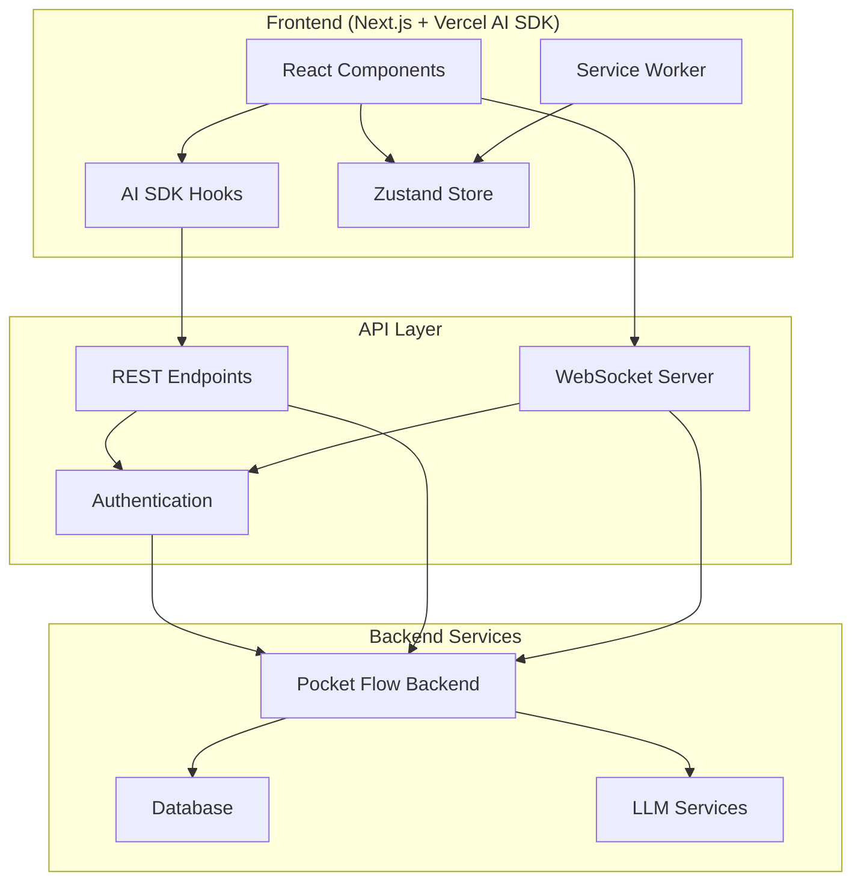

# Design Document

## Overview

The AI Novel Writer Frontend is a modern, responsive web application built with Next.js 14+ and Vercel AI SDK 5 that provides an intuitive interface for the AI-powered novel writing system. The frontend implements a **Real-time Streaming** pattern for AI interactions, **Progressive Web App (PWA)** pattern for offline capabilities, and **Component-Driven Architecture** for maintainable, accessible UI components.

The application serves as the primary user interface for authors, connecting to the existing Python backend through RESTful APIs and WebSocket connections. It emphasizes performance, accessibility, and user experience while providing full access to AI writing assistance, project management, and collaborative features.

## Architecture

### Core Design Patterns

**1. Real-time Streaming Pattern (Vercel AI SDK 5)**
- **Streaming AI Responses**: Use `useChat` and `useCompletion` hooks for real-time AI suggestion streaming
- **Server Actions**: Leverage Next.js Server Actions for seamless client-server communication
- **Edge Runtime**: Deploy AI endpoints on Vercel Edge Runtime for low latency
- **Streaming UI**: Implement streaming UI components that update as AI responses arrive

**2. Progressive Web App (PWA) Pattern**
- **Service Worker**: Cache critical resources and enable offline functionality
- **Background Sync**: Queue API calls when offline and sync when connection is restored
- **Local Storage**: Persist writing sessions and user preferences locally
- **Push Notifications**: Optional writing reminders and goal notifications

**3. Component-Driven Architecture**
- **Atomic Design**: Organize components into atoms, molecules, organisms, and templates
- **Headless UI**: Use Radix UI or similar for accessible, unstyled components
- **Design System**: Implement consistent theming with CSS-in-JS or Tailwind CSS
- **Storybook**: Document and test components in isolation

### System Architecture



### Technology Stack

**Frontend Framework**
- **Next.js 14+**: App Router, Server Components, Server Actions
- **React 18+**: Concurrent features, Suspense, Error Boundaries
- **TypeScript**: Full type safety and developer experience

**AI Integration**
- **Vercel AI SDK 5**: `ai/react`, `ai/rsc` for streaming AI interactions
- **OpenAI Integration**: Direct integration with GPT models via AI SDK
- **Streaming**: Real-time response streaming with `useChat` and `useCompletion`

**State Management**
- **Zustand**: Lightweight state management for global app state
- **React Query/TanStack Query**: Server state management and caching
- **Local Storage**: Persistence for offline capabilities

**UI/UX**
- **Tailwind CSS**: Utility-first styling with custom design system
- **Radix UI**: Accessible, unstyled component primitives
- **Framer Motion**: Smooth animations and transitions
- **React Hook Form**: Form handling with validation

**Development Tools**
- **ESLint + Prettier**: Code formatting and linting
- **Husky**: Git hooks for code quality
- **Storybook**: Component documentation and testing

## Components and Interfaces

### Core Page Components

**1. Dashboard Page (`/dashboard`)**
```typescript
interface DashboardProps {
  projects: Project[]
  user: User
  recentActivity: Activity[]
}

export default function Dashboard({ projects, user, recentActivity }: DashboardProps) {
  // Project grid, search, filters, recent activity
}
```

**2. Writing Editor Page (`/project/[id]/write`)**
```typescript
interface WritingEditorProps {
  project: Project
  chapter: Chapter
  initialContent: string
}

export default function WritingEditor({ project, chapter, initialContent }: WritingEditorProps) {
  // Main text editor with AI assistance
}
```

**3. Knowledge Base Page (`/project/[id]/knowledge`)**
```typescript
interface KnowledgeBaseProps {
  project: Project
  storyElements: StoryElement[]
  relationships: Relationship[]
}

export default function KnowledgeBase({ project, storyElements, relationships }: KnowledgeBaseProps) {
  // Interactive knowledge base visualization
}
```

### AI Integration Components

**1. AI Assistant Panel**
```typescript
interface AIAssistantPanelProps {
  currentPersona: AIPersona
  onPersonaChange: (persona: AIPersona) => void
  isProcessing: boolean
}

export function AIAssistantPanel({ currentPersona, onPersonaChange, isProcessing }: AIAssistantPanelProps) {
  const { messages, input, handleInputChange, handleSubmit, isLoading } = useChat({
    api: '/api/ai/chat',
    initialMessages: [],
    onResponse: (response) => {
      // Handle streaming response
    }
  })
  
  // AI chat interface with persona switching
}
```

**2. Text Editor with AI Suggestions**
```typescript
interface AITextEditorProps {
  content: string
  onChange: (content: string) => void
  onAIRequest: (context: string) => void
}

export function AITextEditor({ content, onChange, onAIRequest }: AITextEditorProps) {
  const { completion, complete, isLoading } = useCompletion({
    api: '/api/ai/complete',
    onFinish: (prompt, completion) => {
      // Handle completion
    }
  })
  
  // Rich text editor with AI suggestion overlay
}
```

**3. Real-time Status Indicator**
```typescript
interface AIStatusIndicatorProps {
  agents: AgentStatus[]
  processingTasks: Task[]
}

export function AIStatusIndicator({ agents, processingTasks }: AIStatusIndicatorProps) {
  // Real-time status of AI agents and background tasks
}
```

### API Route Handlers

**1. AI Chat Endpoint (`/api/ai/chat`)**
```typescript
import { openai } from '@ai-sdk/openai'
import { streamText } from 'ai'

export async function POST(req: Request) {
  const { messages, persona } = await req.json()
  
  const result = await streamText({
    model: openai('gpt-4'),
    messages,
    system: persona.systemPrompt,
  })
  
  return result.toAIStreamResponse()
}
```

**2. AI Completion Endpoint (`/api/ai/complete`)**
```typescript
import { openai } from '@ai-sdk/openai'
import { streamText } from 'ai'

export async function POST(req: Request) {
  const { prompt, context, persona } = await req.json()
  
  const result = await streamText({
    model: openai('gpt-4'),
    prompt: `${context}\n\nContinue writing: ${prompt}`,
    system: persona.systemPrompt,
  })
  
  return result.toAIStreamResponse()
}
```

## Data Models

### Frontend State Schema

```typescript
// Global App State (Zustand)
interface AppState {
  // User & Authentication
  user: User | null
  isAuthenticated: boolean
  
  // Current Project Context
  currentProject: Project | null
  currentChapter: Chapter | null
  currentPosition: TimelinePosition | null
  
  // AI State
  activePersona: AIPersona
  availablePersonas: AIPersona[]
  aiProcessingStatus: ProcessingStatus
  
  // UI State
  sidebarOpen: boolean
  focusMode: boolean
  theme: 'light' | 'dark' | 'system'
  
  // Offline State
  isOnline: boolean
  pendingSync: SyncItem[]
  lastSyncTime: Date | null
}

// Server State (React Query)
interface ServerQueries {
  projects: UseQueryResult<Project[]>
  projectDetails: UseQueryResult<ProjectDetails>
  knowledgeBase: UseQueryResult<KnowledgeBase>
  writingProgress: UseQueryResult<WritingProgress>
}
```

### Component Props Interfaces

```typescript
interface Project {
  id: string
  title: string
  genre: string
  description: string
  createdAt: Date
  updatedAt: Date
  wordCount: number
  chapters: Chapter[]
  metadata: ProjectMetadata
}

interface Chapter {
  id: string
  title: string
  content: string
  wordCount: number
  position: number
  scenes: Scene[]
  lastEditedAt: Date
}

interface AIPersona {
  id: string
  name: string
  specialization: string
  systemPrompt: string
  avatar: string
  capabilities: string[]
  isCustom: boolean
}

interface ProcessingStatus {
  activeAgents: string[]
  currentTasks: Task[]
  queueLength: number
  estimatedCompletion: Date | null
}
```

## Error Handling

### Error Boundary Strategy

**1. Global Error Boundary**
```typescript
export function GlobalErrorBoundary({ children }: { children: React.ReactNode }) {
  return (
    <ErrorBoundary
      FallbackComponent={ErrorFallback}
      onError={(error, errorInfo) => {
        // Log to error reporting service
        console.error('Global error:', error, errorInfo)
      }}
    >
      {children}
    </ErrorBoundary>
  )
}
```

**2. AI Service Error Handling**
```typescript
export function useAIWithFallback() {
  const { completion, complete, error, isLoading } = useCompletion({
    api: '/api/ai/complete',
    onError: (error) => {
      // Fallback to cached suggestions
      toast.error('AI service temporarily unavailable. Using cached suggestions.')
    }
  })
  
  return { completion, complete, error, isLoading }
}
```

**3. Network Error Recovery**
```typescript
export function useOfflineSync() {
  const { isOnline } = useNetworkStatus()
  const { mutate: syncPendingChanges } = useMutation({
    mutationFn: syncToServer,
    retry: 3,
    retryDelay: (attemptIndex) => Math.min(1000 * 2 ** attemptIndex, 30000)
  })
  
  useEffect(() => {
    if (isOnline) {
      syncPendingChanges()
    }
  }, [isOnline])
}
```

## Testing Strategy

### Component Testing
```typescript
// Example component test
import { render, screen, fireEvent } from '@testing-library/react'
import { AITextEditor } from '@/components/AITextEditor'

describe('AITextEditor', () => {
  it('should trigger AI completion on user request', async () => {
    const mockOnAIRequest = jest.fn()
    render(<AITextEditor content="" onChange={() => {}} onAIRequest={mockOnAIRequest} />)
    
    const editor = screen.getByRole('textbox')
    fireEvent.change(editor, { target: { value: 'The hero walked into the' } })
    fireEvent.keyDown(editor, { key: 'Tab', ctrlKey: true })
    
    expect(mockOnAIRequest).toHaveBeenCalledWith('The hero walked into the')
  })
})
```

### API Route Testing
```typescript
// Example API route test
import { POST } from '@/app/api/ai/chat/route'
import { NextRequest } from 'next/server'

describe('/api/ai/chat', () => {
  it('should stream AI responses', async () => {
    const request = new NextRequest('http://localhost:3000/api/ai/chat', {
      method: 'POST',
      body: JSON.stringify({
        messages: [{ role: 'user', content: 'Help me write a story' }],
        persona: { systemPrompt: 'You are a creative writing assistant' }
      })
    })
    
    const response = await POST(request)
    expect(response.status).toBe(200)
    expect(response.headers.get('content-type')).toContain('text/plain')
  })
})
```

### E2E Testing with Playwright
```typescript
// Example E2E test
import { test, expect } from '@playwright/test'

test('complete writing workflow', async ({ page }) => {
  await page.goto('/dashboard')
  
  // Create new project
  await page.click('[data-testid="new-project-button"]')
  await page.fill('[data-testid="project-title"]', 'Test Novel')
  await page.click('[data-testid="create-project"]')
  
  // Start writing
  await page.click('[data-testid="start-writing"]')
  await page.fill('[data-testid="text-editor"]', 'Once upon a time')
  
  // Request AI assistance
  await page.keyboard.press('Control+Tab')
  await expect(page.locator('[data-testid="ai-suggestion"]')).toBeVisible()
})
```

## Performance Optimization

### Code Splitting and Lazy Loading
```typescript
// Lazy load heavy components
const KnowledgeBaseVisualization = lazy(() => import('@/components/KnowledgeBaseVisualization'))
const AdvancedTextEditor = lazy(() => import('@/components/AdvancedTextEditor'))

// Route-based code splitting is automatic with Next.js App Router
```

### Streaming and Suspense
```typescript
// Streaming server components
export default async function ProjectPage({ params }: { params: { id: string } }) {
  return (
    <div>
      <ProjectHeader projectId={params.id} />
      <Suspense fallback={<ProjectContentSkeleton />}>
        <ProjectContent projectId={params.id} />
      </Suspense>
    </div>
  )
}
```

### Virtual Scrolling for Large Documents
```typescript
import { FixedSizeList as List } from 'react-window'

export function VirtualizedChapterList({ chapters }: { chapters: Chapter[] }) {
  const Row = ({ index, style }: { index: number; style: React.CSSProperties }) => (
    <div style={style}>
      <ChapterItem chapter={chapters[index]} />
    </div>
  )
  
  return (
    <List
      height={600}
      itemCount={chapters.length}
      itemSize={80}
      width="100%"
    >
      {Row}
    </List>
  )
}
```

## Deployment and Infrastructure

### Vercel Deployment Configuration
```typescript
// next.config.js
/** @type {import('next').NextConfig} */
const nextConfig = {
  experimental: {
    serverActions: true,
  },
  env: {
    OPENAI_API_KEY: process.env.OPENAI_API_KEY,
    BACKEND_API_URL: process.env.BACKEND_API_URL,
  }
}

module.exports = nextConfig
```

### Environment Variables
```bash
# .env.local
OPENAI_API_KEY=sk-...
BACKEND_API_URL=http://localhost:8000
NEXTAUTH_SECRET=...
NEXTAUTH_URL=http://localhost:3000
```

### PWA Configuration
```typescript
// next-pwa configuration
const withPWA = require('next-pwa')({
  dest: 'public',
  register: true,
  skipWaiting: true,
  runtimeCaching: [
    {
      urlPattern: /^https:\/\/api\.openai\.com\/.*/i,
      handler: 'NetworkFirst',
      options: {
        cacheName: 'openai-api-cache',
        expiration: {
          maxEntries: 16,
          maxAgeSeconds: 24 * 60 * 60 // 24 hours
        }
      }
    }
  ]
})

module.exports = withPWA(nextConfig)
```

## Implementation Phases

### Phase 1: Core Infrastructure
- Next.js project setup with TypeScript and Tailwind CSS
- Basic routing and layout components
- Authentication integration
- API route structure

### Phase 2: Text Editor and AI Integration
- Rich text editor implementation
- Vercel AI SDK integration for streaming responses
- Basic AI assistance features
- Real-time status indicators

### Phase 3: Project Management
- Dashboard and project creation
- Chapter and scene management
- Import/export functionality
- Progress tracking

### Phase 4: Advanced AI Features
- Multiple AI personas
- Knowledge base visualization
- Advanced consistency checking
- Research integration

### Phase 5: PWA and Optimization
- Service worker implementation
- Offline capabilities
- Performance optimization
- Accessibility improvements

### Phase 6: Polish and Testing
- Comprehensive testing suite
- Error handling refinement
- User experience polish
- Documentation and deployment