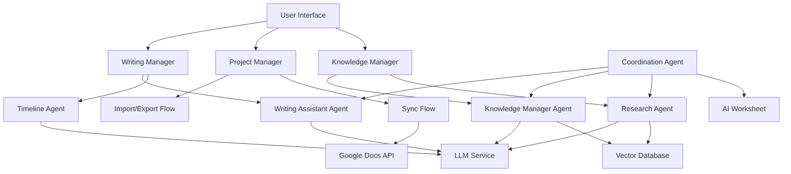

# Design Document

## Overview

The AI Novel Writer is a sophisticated writing assistant built on the Pocket Flow framework that combines multiple AI design patterns to create an intelligent, context-aware novel writing environment. The system integrates **Agent**, **RAG**, **Workflow**, and **Multi-Agent** patterns to provide real-time writing assistance, maintain story consistency, and manage complex narrative structures through temporal awareness.

The application serves as a collaborative partner for authors, offering AI-powered suggestions while preserving human creativity and control. It maintains a dynamic knowledge base that evolves with the story, provides customizable AI personalities, and integrates seamlessly with existing writing workflows through Google Docs synchronization.

## Architecture

### Core Design Patterns

**1. Multi-Agent Pattern**
- **Writing Assistant Agent**: Provides real-time suggestions, dialogue generation, and plot development
- **Knowledge Manager Agent**: Maintains story consistency, tracks character development, and manages temporal context
- **Research Agent**: Processes uploaded documents and provides contextual information retrieval
- **Coordination Agent**: Manages the AI's internal worksheet and orchestrates agent activities

**2. RAG Pattern**
- **Offline Indexing**: Process and embed research documents, character profiles, and world-building notes
- **Online Retrieval**: Contextual information retrieval based on current writing position and story timeline
- **Temporal RAG**: Timeline-aware retrieval that only surfaces information relevant to the current story moment

**3. Workflow Pattern**
- **Writing Flow**: Real-time assistance during active writing sessions
- **Analysis Flow**: Background processing for story consistency and knowledge base updates
- **Import/Export Flow**: Document processing and format conversion workflows
- **Sync Flow**: Google Docs integration and conflict resolution

### System Architecture



## Components and Interfaces

### Core Components

**1. Writing Manager**
- Manages active writing sessions and real-time AI assistance
- Coordinates between Writing Assistant Agent and Timeline Agent
- Handles auto-save and session persistence
- Provides distraction-free writing environment

**2. Project Manager**
- Novel project creation and organization
- Chapter and scene structure management
- Import/export functionality with multiple format support
- Google Docs integration and synchronization

**3. Knowledge Manager**
- Maintains the AI-powered knowledge base with temporal awareness
- Processes story elements and creates relationship mappings
- Handles research document integration via RAG
- Provides consistency checking and conflict detection

**4. AI Coordination System**
- Central worksheet for AI task management
- Agent orchestration and priority management
- Background processing coordination
- Performance monitoring and optimization

### Agent Interfaces

**Writing Assistant Agent**
```python
class WritingAssistantAgent:
    def get_suggestions(self, context: str, position: TimelinePosition) -> List[Suggestion]
    def generate_dialogue(self, character: str, context: str) -> str
    def suggest_plot_development(self, current_state: StoryState) -> List[PlotSuggestion]
    def rewrite_text(self, text: str, style: WritingStyle) -> List[str]
```

**Knowledge Manager Agent**
```python
class KnowledgeManagerAgent:
    def extract_story_elements(self, text: str, position: TimelinePosition) -> StoryElements
    def update_knowledge_base(self, elements: StoryElements) -> None
    def check_consistency(self, new_content: str, position: TimelinePosition) -> List[Inconsistency]
    def query_knowledge(self, query: str, position: TimelinePosition) -> KnowledgeResponse
```

**Research Agent**
```python
class ResearchAgent:
    def process_documents(self, documents: List[Document]) -> None
    def retrieve_relevant_info(self, query: str, context: str) -> List[ResearchResult]
    def integrate_research(self, story_context: str) -> List[ResearchSuggestion]
```

## Data Models

### Shared Store Schema

```python
shared_store = {
    # Project Data
    "current_project": ProjectMetadata,
    "active_chapter": ChapterData,
    "current_position": TimelinePosition,
    
    # Writing Session
    "current_text": str,
    "cursor_position": int,
    "writing_context": WritingContext,
    
    # Knowledge Base
    "story_elements": Dict[str, StoryElement],
    "character_database": Dict[str, Character],
    "timeline": List[TimelineEvent],
    "relationships": List[Relationship],
    
    # AI State
    "active_persona": AIPersona,
    "ai_worksheet": List[AITask],
    "suggestion_history": List[Suggestion],
    
    # Research & RAG
    "research_index": VectorIndex,
    "document_chunks": List[DocumentChunk],
    "embeddings": Dict[str, Vector],
    
    # Sync & Export
    "google_docs_token": str,
    "sync_status": SyncStatus,
    "export_queue": List[ExportTask]
}
```

### Core Data Models

**TimelinePosition**
```python
@dataclass
class TimelinePosition:
    chapter: int
    scene: int
    paragraph: int
    timestamp: datetime
    story_time: Optional[str]  # In-story time reference
```

**StoryElement**
```python
@dataclass
class StoryElement:
    id: str
    type: ElementType  # CHARACTER, LOCATION, EVENT, OBJECT
    name: str
    description: str
    first_appearance: TimelinePosition
    last_update: TimelinePosition
    properties: Dict[str, Any]
    relationships: List[str]  # IDs of related elements
```

**AIPersona**
```python
@dataclass
class AIPersona:
    name: str
    specialization: str
    system_prompt: str
    style_preferences: Dict[str, str]
    active_capabilities: List[str]
```

## Error Handling

### Graceful Degradation Strategy

**1. LLM Service Failures**
- Fallback to cached suggestions when API is unavailable
- Queue requests for retry with exponential backoff
- Provide offline writing mode with reduced AI features

**2. Knowledge Base Inconsistencies**
- Flag conflicts for user review rather than auto-resolving
- Maintain version history for rollback capabilities
- Provide manual override options for AI decisions

**3. Sync Conflicts**
- Present clear diff views for Google Docs conflicts
- Allow selective merge of changes
- Maintain local backup before sync operations

**4. Performance Issues**
- Implement lazy loading for large knowledge bases
- Background processing for non-critical AI tasks
- Progressive enhancement of AI features based on system capacity

### Retry Mechanisms

Leverage Pocket Flow's built-in retry mechanisms:
- Node-level retries for transient failures
- Circuit breaker pattern for external API calls
- Graceful fallback to reduced functionality

## Testing Strategy

### Unit Testing
- **Utility Functions**: Test each utility function with comprehensive input/output validation
- **Node Logic**: Test prep/exec/post methods independently
- **Data Models**: Validate serialization/deserialization and business logic

### Integration Testing
- **Flow Testing**: End-to-end testing of complete workflows
- **Agent Coordination**: Test multi-agent interactions and shared store communication
- **External Integrations**: Mock Google Docs API and LLM services for reliable testing

### User Acceptance Testing
- **Writing Scenarios**: Test common writing workflows and edge cases
- **Performance Testing**: Validate response times for real-time assistance
- **Consistency Testing**: Verify knowledge base accuracy across complex story scenarios

### AI Quality Testing
- **Suggestion Relevance**: Evaluate AI suggestion quality and contextual appropriateness
- **Consistency Checking**: Test temporal awareness and conflict detection accuracy
- **Persona Effectiveness**: Validate different AI personalities and customization options

## Implementation Phases

### Phase 1: Core Writing Environment
- Basic project management and text editor
- Simple AI writing assistance without temporal awareness
- Auto-save and session management

### Phase 2: Knowledge Base Foundation
- Story element extraction and basic knowledge base
- Character and location tracking
- Simple consistency checking

### Phase 3: Temporal Awareness
- Timeline positioning and context switching
- Advanced knowledge base with temporal filtering
- Sophisticated consistency checking

### Phase 4: Advanced AI Features
- Multiple AI personas and customization
- Research document integration via RAG
- AI coordination worksheet

### Phase 5: Integration & Polish
- Google Docs synchronization
- Advanced export options
- Performance optimization and user experience refinement